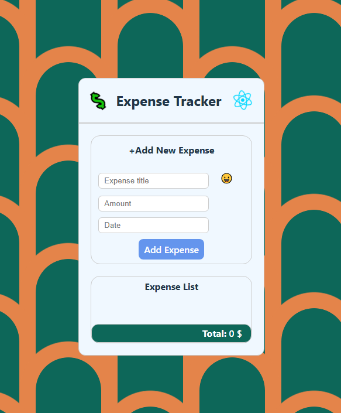

# 💰 Expense Tracker  

A simple and modern **Expense Tracker App** built with **React**.  
This app allows you to add, manage, and track your daily expenses with features like emoji selector, date picker, and clean UI.  

---

## ✨ Features  

- ➕ **Add new expenses** with name, amount, and date  
- 😀 **Emoji selector** (powered by [emoji-mart](https://github.com/missive/emoji-mart))  
- 📅 **Date picker** for choosing expense date  
- 🔢 **Number-only input** for expense amount (regex validation)  
- 🎨 Clean and responsive UI  

---


## 📌 Future Improvements

- 📊 Add charts & statistics
- 💾 Save expenses in localStorage or database
- 📱 Better mobile UI

---

## 🚀 Tech Stack  

- ⚛️ React (Vite)  
- 🎭 emoji-mart  
- 📅 react-datepicker  
- 🖌️ Custom CSS  

---

## 📸 Screenshot  


---

## 📂 Project Structure
```
expense-tracker/
 ┣ 📂 src
 ┃ ┣ 📂 components
 ┃ ┃ ┣ AddNewExpense.jsx
 ┃ ┃ ┣ Input.jsx
 ┃ ┃ ┗ Button.jsx
 ┃ ┣ App.jsx
 ┃ ┣ index.css
 ┃ ┗ main.jsx
 ┣ package.json
 ┣ README.md
```
---
## 🛠️ Installation & Setup

```
git clone https://github.com/mahdinap/expense-tracker.git
cd expense-tracker
```
Install dependencies:
```
npm install
```
Run the project:
```
npm run dev
```
---

👨‍💻 Author:
Developed by Mahdi Nap
